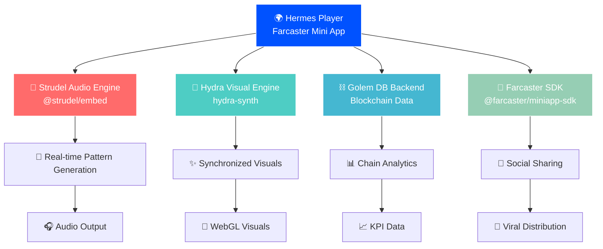

# 🎵 Hermes Player - Blockchain Audio + Visual Experience

<h4 align="center">
  <a href="https://nextjs-mumyio3nb-shahryarbhms-projects.vercel.app">Live Demo</a> |
  <a href="https://nextjs-mumyio3nb-shahryarbhms-projects.vercel.app/.well-known/farcaster.json">Farcaster Manifest</a> |
  <a href="https://miniapps.farcaster.xyz">Mini Apps</a>
</h4>

🎵 **The first blockchain audio-visual experience as a Farcaster Mini App!** Turn real-time blockchain data into immersive generative music with synchronized WebGL visuals. Experience the sound of DeFi through Strudel patterns and Hydra visuals.

🌍 **Built as a Farcaster Mini App** for instant discovery and viral sharing through social feeds.

## 🏗️ Architecture



## ✨ Key Features

- 🎵 **Generative Music**: Real-time Strudel.js patterns driven by blockchain KPIs
- 🎨 **Vivid Synchronized Visuals**: Hydra-synth WebGL visuals with tempo-synced animations, kaleidoscope effects, and chain-specific color themes
- ⛓️ **Multi-Chain Support**: Ethereum, Base, Bitcoin, Polygon, Arbitrum, Optimism
- 📱 **Farcaster Native**: Built as a Mini App for instant social discovery
- 🔗 **Social Sharing**: One-tap sharing for viral growth through feeds
- 🌊 **Immersive Experience**: Fullscreen glassmorphism UI with responsive design

## 🚀 Live Demo

**🌍 Try it now**: [https://nextjs-mumyio3nb-shahryarbhms-projects.vercel.app](https://nextjs-mumyio3nb-shahryarbhms-projects.vercel.app)

**📱 Farcaster Mini App**: Access directly through Farcaster clients for the full social experience!

## 🛠️ Tech Stack

- **Frontend**: Next.js 15 + React 19 + TypeScript
- **Audio Engine**: Strudel.js (`@strudel/embed`) 
- **Visual Engine**: Hydra-synth WebGL
- **Blockchain Data**: Golem DB with Base SDK
- **Social Platform**: Farcaster Mini App SDK
- **Styling**: TailwindCSS + DaisyUI + Glassmorphism
- **Deployment**: Vercel

## 📋 Requirements

- [Node.js (>= v22.11.0)](https://nodejs.org/en/download/) - Required for Farcaster SDK
- [Yarn](https://classic.yarnpkg.com/en/docs/install/)
- [Git](https://git-scm.com/downloads)

## 🏃‍♂️ Quick Start

1. **Clone and install dependencies**:

```bash
git clone <repository-url>
cd hermes-player
yarn install
```

2. **Start local development**:

```bash
# Start the blockchain (optional for frontend development)
yarn chain

# Start the Next.js app
yarn start
```

3. **Visit the app**: `http://localhost:3000`

## 🎵 How It Works

1. **Data Ingestion**: Real-time blockchain KPIs from Golem DB
2. **Music Generation**: KPIs drive Strudel.js pattern parameters (tempo, scale, complexity)
3. **Visual Sync**: Hydra-synth generates WebGL visuals based on musical patterns
4. **Social Distribution**: Share tracks through Farcaster for viral growth

## 🗂️ Project Structure

```
packages/
├── nextjs/                 # Farcaster Mini App
│   ├── components/         # React components
│   │   ├── HermesPlayer.tsx    # Main player interface
│   │   └── MiniKitProvider.tsx # Farcaster integration
│   ├── services/           # Core services
│   │   ├── api/               # Golem DB & mock APIs
│   │   └── visuals/           # Hydra visual engine
│   ├── hooks/              # Custom React hooks
│   │   └── useMiniKit.ts      # Farcaster Mini App hooks
│   └── public/
│       └── .well-known/
│           └── farcaster.json # Mini App manifest
└── foundry/                # Smart contracts (future expansion)
```

## 🌍 Farcaster Mini App

Hermes Player is built as a native Farcaster Mini App, enabling:

- **🔄 Instant Access**: No downloads, launches directly in Farcaster
- **📱 Social Native**: Built-in sharing and discovery through feeds  
- **🤝 Viral Growth**: Every interaction becomes potential distribution
- **🎯 Network Effects**: Grows through existing social connections

### Mini App Features

- ✅ Farcaster SDK integration
- ✅ Social sharing functionality  
- ✅ Mobile-optimized responsive design
- ✅ Proper manifest configuration
- ✅ Production deployment ready

## 🔧 Development

### Adding New Blockchain Data Sources

1. Extend the `StrudelTrack` interface in `types/hermes.ts`
2. Add API integration in `services/api/`
3. Update musical parameter mapping in `services/visuals/hydraService.ts`

### Customizing Visuals

The Hydra visual engine maps musical parameters to visual effects:

- **Tempo** → Animation speed and rotation frequency
- **Complexity** → Kaleidoscope segment count and visual intensity
- **Network Activity** → Noise levels and visual chaos
- **Chain Type** → Color themes (Ethereum: Blue, Bitcoin: Orange, Base: Base Blue, etc.)
- **Musical Effects** → Shader modulations and visual filters

### Chain-Specific Visual Themes
- 🔵 **Ethereum**: Deep blue (0.4, 0.6, 1.0)
- 🟠 **Bitcoin**: Orange (1.0, 0.6, 0.0) 
- 🟣 **Polygon**: Purple (0.8, 0.4, 1.0)
- 🔷 **Arbitrum**: Cyan (0.2, 0.8, 1.0)
- 🔴 **Optimism**: Red (1.0, 0.2, 0.2)
- 🔵 **Base**: Base Blue (0.0, 0.4, 1.0)

## 🚀 Deployment

The app is deployed on Vercel with automatic builds:

```bash
# Deploy to production
npx vercel --prod
```

**Production URL**: https://nextjs-mumyio3nb-shahryarbhms-projects.vercel.app

## 🤝 Contributing

We welcome contributions! This project combines:

- 🎵 **Audio Engineering**: Strudel.js pattern development
- 🎨 **Visual Programming**: Hydra-synth shader creation  
- ⛓️ **Blockchain Integration**: Data source expansion
- 📱 **Social Features**: Farcaster Mini App enhancements

## 📄 License

MIT License - see LICENSE file for details.

---

**🎵 Experience the sound of blockchain data with Hermes Player!**